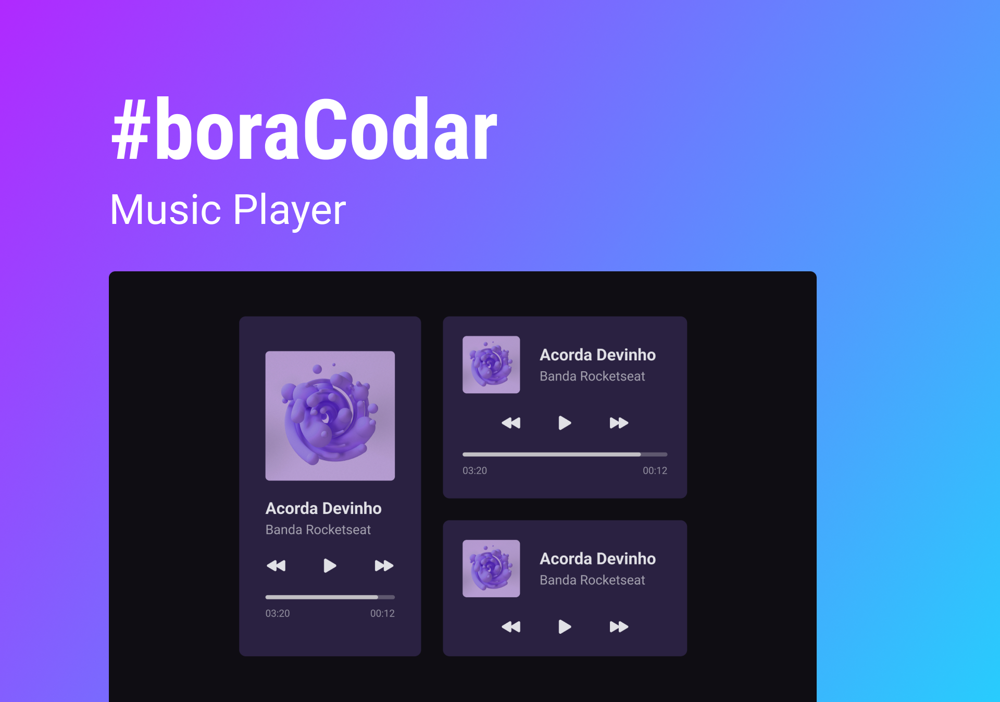

<h1 align="center"> Music Player </h1>

  <a href="#-tecnologias">Tecnologias</a>&nbsp;&nbsp;&nbsp;|&nbsp;&nbsp;&nbsp;
  <a href="#-projeto">Projeto</a>&nbsp;&nbsp;&nbsp;|&nbsp;&nbsp;&nbsp;
  <a href="#memo-licença">Licença</a>

  

 

  

## 🚀 Tecnologias

Esse projeto foi desenvolvido com as seguintes tecnologias:

- HTML
- CSS
- Git 
- Github
- Figma

## 💻 Projeto

Music Player criado com intuito de fortalecer conhecimentos de HTML e CSS

- [Acesse o projeto finalizado, online](https://music-player-nine-azure.vercel.app/)

## :memo: Licença

Esse projeto está sob a licença MIT.
